# 💊 MediTrack — Medical Inventory & Demand Forecasting System

> A web-based pharmacy management system that combines inventory control, billing, sales analytics, expiry/wastage tracking, and hybrid demand forecasting to support smarter medicine restocking.

## 📌 Overview

**MediTrack** is a Flask-based pharmacy management application designed around the day-to-day workflow of a pharmacy.

The system provides a centralized interface for:

- Managing medicines and stock
- Monitoring low-stock and expiring batches
- Processing bills and returns
- Managing customers and staff accounts
- Tracking suppliers and purchase orders
- Importing historical sales data
- Forecasting medicine demand
- Evaluating forecast accuracy
- Generating restocking recommendations
- Exporting operational data to Excel
- Generating PDF invoices

The forecasting module combines **ARIMA + LSTM** and exposes metrics such as MAE, RMSE, and MAPE for model evaluation.

---

## ✨ Key Features

### 📊 Dashboard & Analytics

- Daily sales overview
- Monthly sales trends
- Low-stock alerts
- Expiry alerts
- Top-selling medicines
- Revenue and billing summaries
- Staff/cashier performance analysis

### 💊 Inventory Management

- Medicine catalogue
- Stock-level monitoring
- Reorder levels
- Medicine search
- Supplier management
- Purchase order creation and receiving
- Expiring-batch tracking
- Wastage/write-off tracking
- Excel export

### 🤖 Hybrid Demand Forecasting

MediTrack includes a hybrid forecasting workflow using:

**ARIMA + LSTM**

The application can:

1. Select a medicine
2. Choose a forecast horizon
3. Process historical sales
4. Generate future demand estimates
5. Display forecast results graphically
6. Calculate model error metrics
7. Produce an EOQ/reorder recommendation

The interface displays metrics including:

- Average daily demand
- MAE — Mean Absolute Error
- RMSE — Root Mean Squared Error
- MAPE — Mean Absolute Percentage Error
- Days of stock remaining
- Economic Order Quantity (EOQ)
- Reorder Point
- Supplier lead time

> Forecast quality depends on the amount and quality of historical sales data available for each medicine.

### 🔄 Reorder Suggestions

The recommendation engine combines forecast and inventory information to identify medicines that may require restocking.

It categorizes items into:

- **Reorder Now**
- **Stocked OK**
- **Needs a Forecast**

Suggested order quantities and reorder timing are shown together with supplier information.

### 🧾 Billing & Point of Sale

- Search medicines at the point of sale
- Add medicines to the current bill
- Calculate subtotal, discount, tax, and total
- Capture optional customer details
- Support multiple payment modes
- Generate invoices
- View billing history
- Export billing records to Excel

### 🔁 Returns & Refunds

- Record returned items
- Track refund amounts
- Record return reasons
- View processed returns
- Maintain a return history

### ⚠️ Expiry & Wastage Management

- Identify batches approaching expiry
- Display days remaining
- Write off expired stock
- Track units written off
- Calculate loss value
- View write-off events and reasons

### 👥 Staff & Access Management

- Staff account creation
- Role-based access
- Administrator and operational roles
- Staff activation/deactivation
- Staff directory
- Cashier performance tracking

### 📥 Data Import & Export

- Import historical sales using CSV
- Export supported records to Excel
- Generate PDF invoices

---

## 🖥️ Screenshots

### 🔐 Login

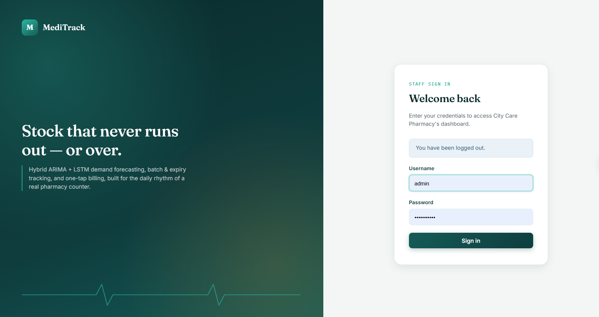

### 📊 Dashboard

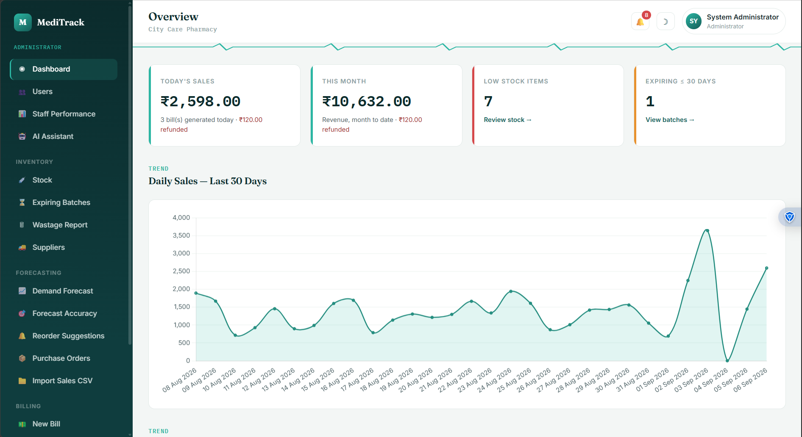

### 📈 Sales Analytics

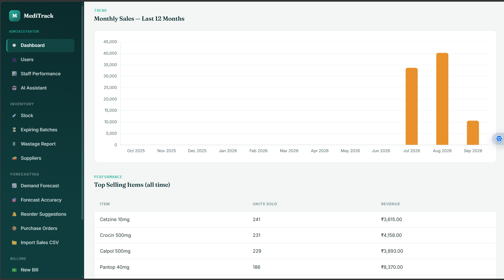

### 💊 Inventory

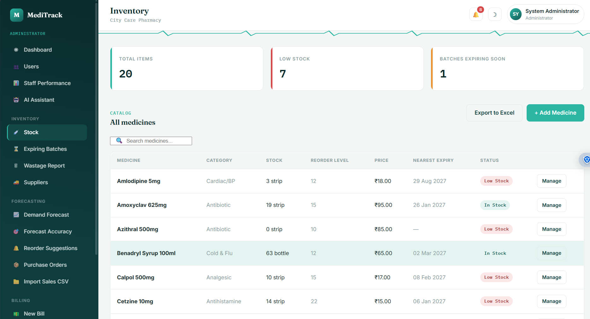

### 🤖 Demand Forecast

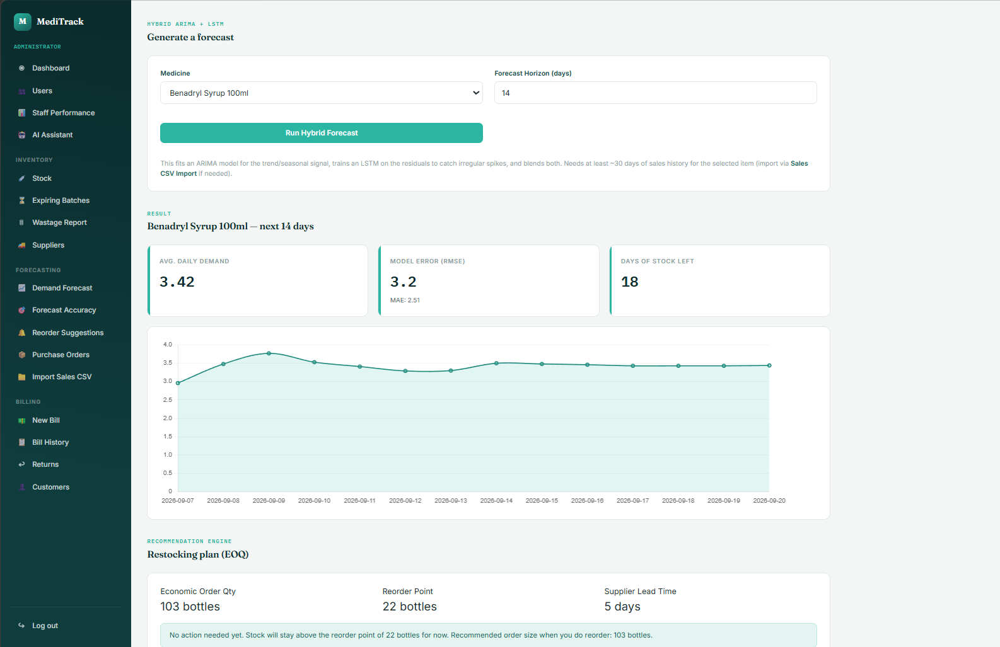

### 🔄 Reorder Suggestions

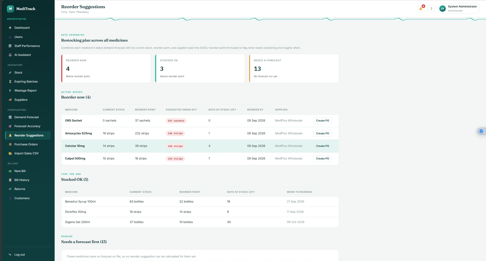

### 📏 Forecast Accuracy

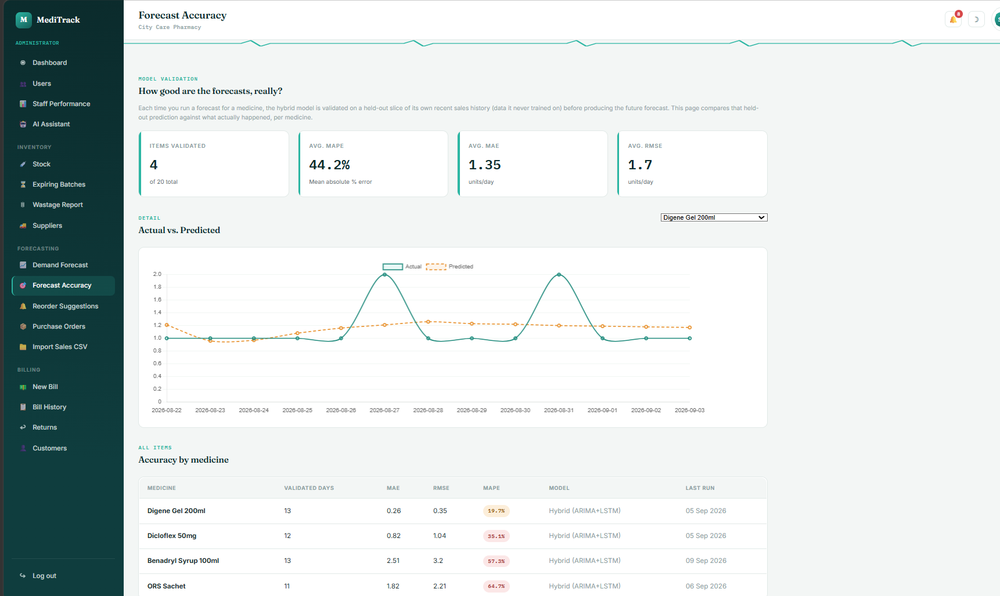

### 🧾 New Bill / Point of Sale

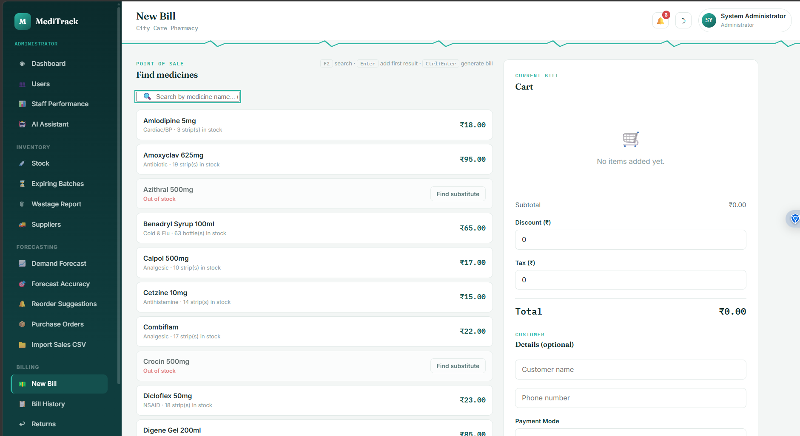

### 📋 Bill History

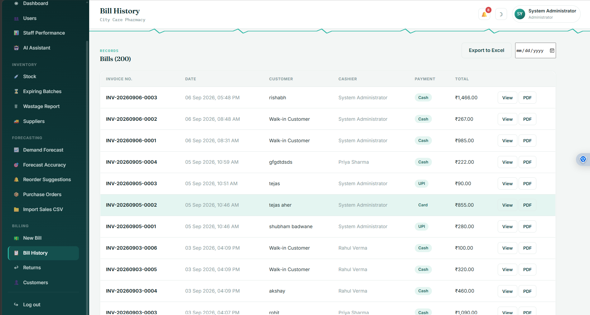

### 🧾 Generated Invoice

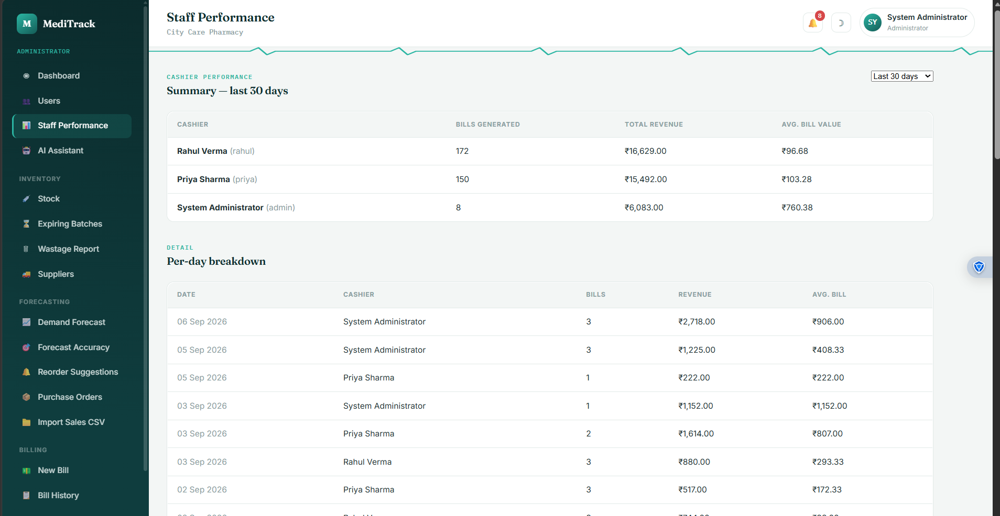

### ⏳ Expiring Batches

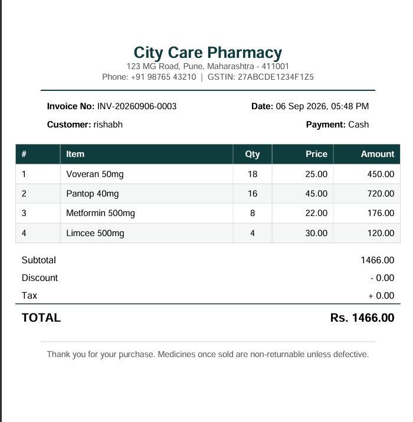

### 🗑️ Wastage Report

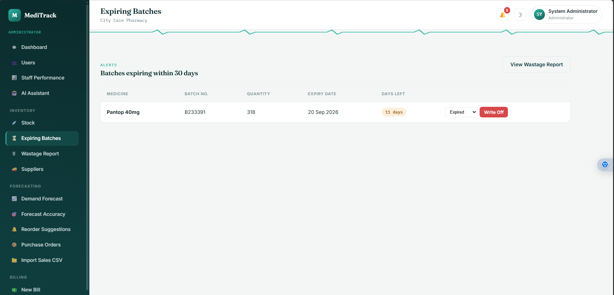

### 📦 Purchase Orders

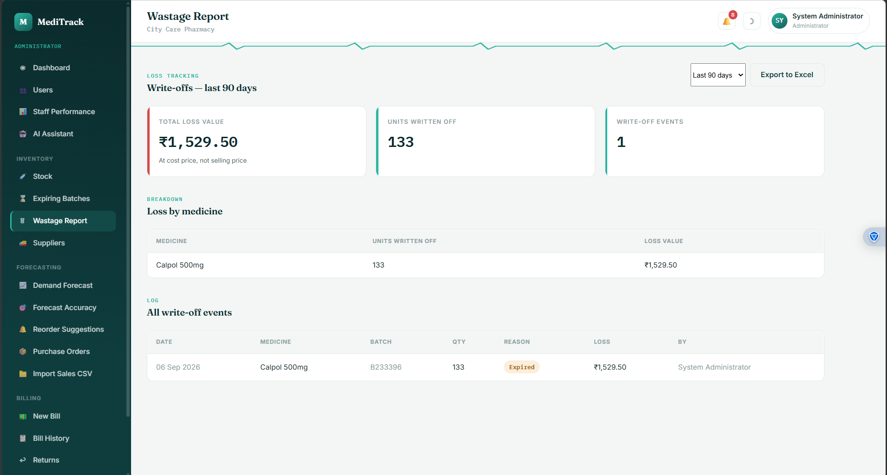

### ↩️ Returns & Refunds

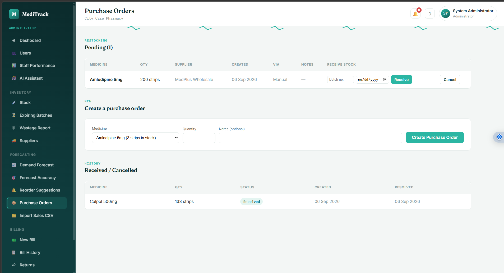

### 👥 Staff Accounts

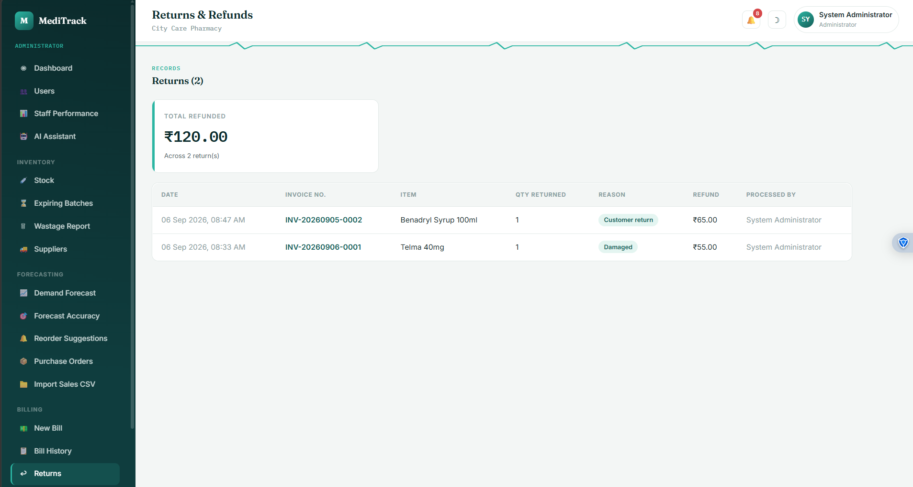

### 📊 Staff Performance

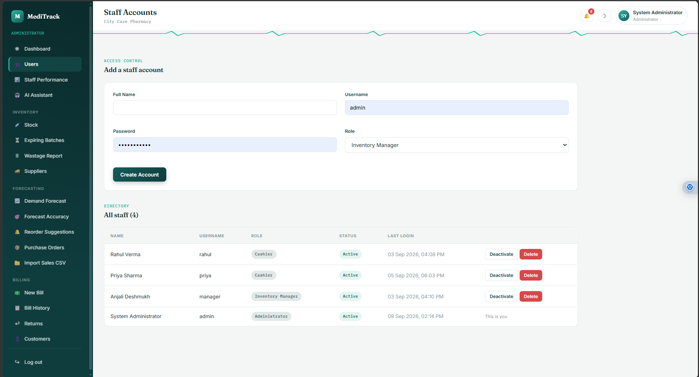

---

## 🛠️ Technology Stack

| Area | Technology |
|---|---|
| Backend | Python, Flask |
| Database / ORM | SQLAlchemy |
| Frontend | HTML5, CSS3, JavaScript, Jinja2 |
| Data Processing | Pandas, NumPy |
| Forecasting | ARIMA + LSTM |
| Charts | Chart.js |
| File Import | CSV |
| Data Export | Excel |
| Documents | PDF |
| Version Control | Git, GitHub |

---

## 🏗️ Application Architecture

```text
                        ┌─────────────────────┐
                        │      MediTrack      │
                        │   Flask Web App     │
                        └──────────┬──────────┘
                                   │
             ┌─────────────────────┼─────────────────────┐
             │                     │                     │
             ▼                     ▼                     ▼
      ┌─────────────┐       ┌─────────────┐       ┌─────────────┐
      │   Admin &   │       │ Inventory & │       │ Billing &   │
      │    Users    │       │ Forecasting │       │  Customers  │
      └─────────────┘       └──────┬──────┘       └─────────────┘
                                   │
                                   ▼
                         ┌──────────────────┐
                         │ Historical Sales │
                         │      Data        │
                         └────────┬─────────┘
                                  │
                                  ▼
                         ┌──────────────────┐
                         │ ARIMA + LSTM     │
                         │    Forecast      │
                         └────────┬─────────┘
                                  │
                                  ▼
                         ┌──────────────────┐
                         │ Reorder / EOQ    │
                         │ Recommendations  │
                         └──────────────────┘
```

---

## 📂 Project Structure

```text
meditrack-medical-inventory/
│
├── app/
│   ├── admin/
│   ├── ai/
│   ├── auth/
│   ├── cashier/
│   ├── customers/
│   ├── forecasting/
│   ├── inventory/
│   ├── utils/
│   ├── static/
│   ├── templates/
│   ├── config.py
│   ├── decorators.py
│   ├── extensions.py
│   └── models.py
│
├── data/
├── instance/
├── uploads/
│
├── backfill_bills_from_history.py
├── migrate_add_generic_name.py
├── migrate_add_returns_and_accuracy.py
├── requirements.txt
├── run.py
├── seed_demo_data.py
├── seed_real_data.py
├── seed_two_month_demo.py
├── .env.example
├── .gitignore
└── README.md
```

---

## ⚙️ Installation

### 1. Clone the repository

```bash
git clone https://github.com/vaibhavbhalerao22/meditrack-medical-inventory.git
cd meditrack-medical-inventory
```

### 2. Create a Python virtual environment

For Windows:

```powershell
py -3.11 -m venv venv
```

Activate it:

```powershell
venv\Scripts\activate
```

For Linux/macOS:

```bash
python3.11 -m venv venv
source venv/bin/activate
```

### 3. Install dependencies

```bash
python -m pip install --upgrade pip
pip install -r requirements.txt
```

### 4. Configure environment variables

Create a local `.env` file based on:

```text
.env.example
```

Do not commit `.env` or any secret credentials to GitHub.

### 5. Run the application

```bash
python run.py
```

Open the local URL displayed by Flask in your browser.

---

## 📊 Forecasting Workflow

```text
Historical Sales Data
          │
          ▼
      CSV Import
          │
          ▼
   Data Preparation
          │
          ▼
      ARIMA Model
          │
          ├──────────────┐
          │              │
          ▼              ▼
     Trend/Seasonal   Residuals
       Signal            │
                         ▼
                    LSTM Model
                         │
                         ▼
                   Hybrid Output
                         │
                         ▼
                  Demand Forecast
                         │
                         ▼
                EOQ / Reorder Plan
```

The application also provides a forecast-accuracy view comparing **actual vs. predicted** values and reporting MAE, RMSE, and MAPE.

---

## 🔄 Inventory Decision Workflow

```text
Current Stock
     │
     ├───────────────┐
     │               │
     ▼               ▼
Reorder Point    Forecast Demand
     │               │
     └───────┬───────┘
             ▼
      Restocking Logic
             │
       ┌─────┼─────┐
       ▼     ▼     ▼
    Reorder  OK   Forecast
      Now          Needed
             │
             ▼
       Suggested Order
```

---

## 🔐 Security Notes

The repository uses `.gitignore` rules to keep local and sensitive files out of version control, including:

- `.env`
- Local database files
- Virtual environments
- Python cache files
- Uploaded CSV files
- Log files

**Never commit passwords, API keys, tokens, or private customer/pharmacy data.**

For a public demo, use synthetic or demo data rather than real customer records.

---

## 🧪 Local Development

The project has been tested from a fresh GitHub clone using **Python 3.11**, with dependencies installed through `requirements.txt`.

Recommended development workflow:

```bash
git pull
# make changes
git add .
git commit -m "Describe your changes"
git push
```

---

## 🚀 Future Enhancements

Potential improvements include:

- Cloud deployment
- Mobile-responsive improvements
- Automated stock alerts
- Email/SMS notifications
- Barcode/QR-code integration
- Advanced forecasting models
- Automated purchase-order generation
- Supplier performance analytics
- Advanced pharmacy analytics
- Role-specific dashboards
- Backup and recovery support

---

## 🎯 Project Objectives

MediTrack aims to:

1. Digitize pharmacy inventory operations.
2. Simplify billing and customer management.
3. Track medicine stock and expiry information.
4. Analyze historical sales.
5. Forecast future medicine demand.
6. Provide data-driven reorder recommendations.
7. Track wastage and inventory losses.
8. Improve operational visibility for pharmacy staff.

---

## 👨‍💻 Developer

**Vaibhav Bhalerao**

GitHub: [@vaibhavbhalerao22](https://github.com/vaibhavbhalerao22)

Repository: [meditrack-medical-inventory](https://github.com/vaibhavbhalerao22/meditrack-medical-inventory)

---

## 📄 License

This project was developed for educational, academic, and portfolio purposes.

---

⭐ If you found this project interesting, consider starring the repository!
